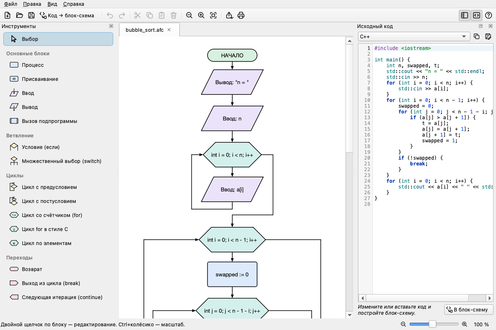
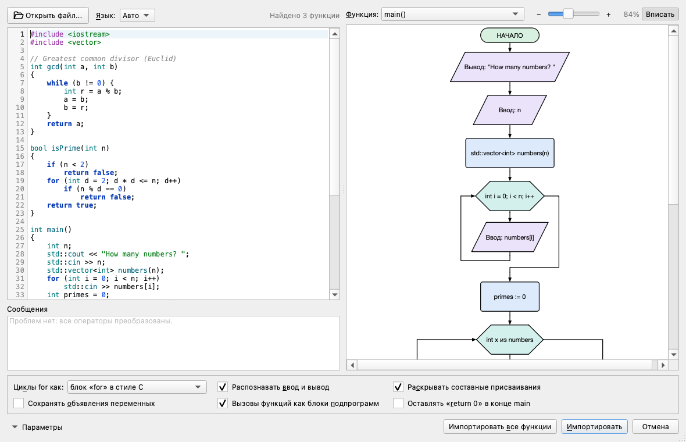
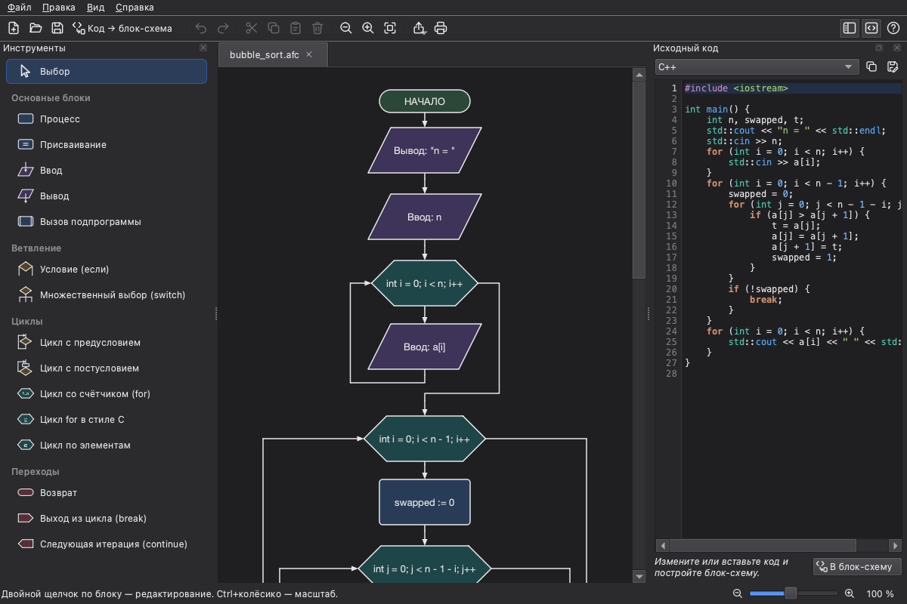

AFCE Reimagined
===============

**Редактор блок-схем алгоритмов** для уроков информатики и программирования: рисует блок-схемы по ГОСТ 19.701-90,
генерирует по ним код на 13 языках и — главное нововведение — **строит блок-схемы по коду на C и C++**.

Это переработанная версия [AFCE](https://github.com/viktor-zin/afce) Виктора Зинкевича: программа переведена на
современный стек, получила новый интерфейс, новые блоки и импорт исходного кода.
[English version](README.en.md)

Что нового по сравнению с AFCE 0.9.8
------------------------------------

### Код → блок-схема (C и C++)
* **Файл → Импорт из исходного кода** (Ctrl+I, кнопка «Код → блок-схема»): вставьте код или откройте файл,
  выберите функцию и сразу увидите блок-схему в окне предпросмотра. Можно импортировать одну функцию или все
  сразу — каждую в своей вкладке. Файл `.c` / `.cpp` можно просто перетащить в окно программы.
* **Двусторонняя панель кода**: для C и C++ код справа можно править и нажать «В блок-схему» (Ctrl+Enter) —
  схема текущей вкладки перестроится (Ctrl+Z вернёт прежнюю).
* Понимает `if/else`, `switch` (в том числе «проваливание» между `case`), `while`, `do-while`, `for`, range-`for`,
  `return`, `break`, `continue`, присваивания (`x += 2` → `x := x + 2`), ввод/вывод через
  `scanf`/`printf`/`puts`/`gets`/`cin`/`cout`/`getline`, вызовы функций; находит функции в классах, пространствах
  имён и шаблонах. Что нельзя показать на блок-схеме (`goto`, обработчики исключений, директивы препроцессора),
  перечисляется в списке сообщений со ссылкой на строку кода.
* Собственный разборщик C/C++ без внешних зависимостей, проверенный на корпусе учебных программ и fuzz-тестах.

### Новые блоки
Множественный выбор (`switch`), цикл `for` в стиле C, цикл по элементам (`for each`), вызов подпрограммы
(предопределённый процесс), возврат (`return`), выход (`break`) и следующая итерация (`continue`). Для каждого блока
есть диалог свойств; у блока начала можно задать имя, параметры и тип результата функции.

### Современный интерфейс
* Вкладки вместо запуска новой копии программы, список недавних файлов, диалоги сохранения при закрытии.
* Блоки **перетаскиваются мышью** — и из палитры слева прямо на схему, и внутри схемы (с Ctrl/Alt — копирование).
* Блоки подстраивают размер под текст, аккуратные цвета по типам блоков или классический чёрно-белый вид по ГОСТ.
* Светлая и **тёмная тема**, чёткие иконки на HiDPI-экранах, масштаб колесом с Ctrl, жестом на тачпаде,
  «вписать в окно».
* Выбор знака присваивания: `:=`, `=` или `←`.
* Подсветка синтаксиса в панели кода, копирование и сохранение кода в файл.
* Интерфейс и справка на русском, украинском и английском.

### Генерация кода
C, C++, Pascal, Python, JavaScript, PHP, Perl, Ruby, BASIC-256, FreeBASIC, VBScript, AutoIt и алгоритмический язык
(КуМир). Все генераторы поддерживают новые блоки, исправлены старые ошибки: `void main`, опечатка `sdt::cin`,
отсутствующая `;` после `do … while`, неверная граница цикла `for`, инвертированное условие цикла с постусловием в
Python, неверные отступы при глубокой вложенности. Для C/C++ генератор сам объявляет переменные и подбирает
форматы `printf`/`scanf`. Генераторы — это JSON-файлы (`generators/`), формат описан в `sourcecodegenerator.h`.

### Экспорт и командная строка
* Экспорт в PNG, SVG, PDF, копирование схемы как картинки, печать — всегда в светлом «документном» стиле,
  даже если программа работает в тёмной теме.
* Работа без графического интерфейса:

      afce схема.afc --export схема.png --zoom 2          # картинка / svg / pdf
      afce --import prog.c --function main --export схема.pdf
      afce-cli import prog.cpp --function main --output prog.afc
      afce-cli generate prog.afc --lang py                 # код по блок-схеме
      afce-cli functions prog.c                            # список функций

### Под капотом
* Qt 6 и C++17 вместо Qt 4/5, сборка CMake вместо qmake; генераторы, справка и переводы встроены в программу.
* Исправлены ошибки старой версии: переключение языка на лету, утечки памяти, падения при закрытии окна и на
  повреждённых файлах, молчаливые ошибки сохранения, прокрутка на тачпаде.
* Более 1100 автоматических тестов: модель и отрисовка, интерфейс, генераторы (сгенерированные программы
  реально компилируются и запускаются), импорт C/C++, командная строка.
* Сборка и тесты на Linux, macOS и Windows в GitHub Actions; готовые пакеты для всех трёх систем.

Установка
---------
Готовые сборки — на странице [Releases](https://github.com/Heisenberg4441/afce-reimagined/releases)
(сборки последних изменений — в артефактах [Actions](https://github.com/Heisenberg4441/afce-reimagined/actions)):

| Система | Файл | Как запустить |
|---------|------|---------------|
| Windows 10/11 (x64) | `afce-…-windows-x64.zip` | распаковать, запустить `afce\bin\afce.exe` |
| macOS 12+ (Apple Silicon и Intel) | `afce-…-macos-universal.dmg` | перетащить AFCE в «Программы»; сборка не подписана, поэтому при первом запуске: правый щелчок → «Открыть» (или `xattr -dr com.apple.quarantine /Applications/afce.app`) |
| Linux (x86_64) | `afce-…-linux-x86_64.AppImage` | `chmod +x afce-*.AppImage && ./afce-*.AppImage` |

Сборка из исходников
--------------------
Нужны Qt 6.5+ (модули Core, Gui, Widgets, Xml, Svg, PrintSupport, LinguistTools) и CMake 3.21+:

    cmake -S . -B build -DCMAKE_BUILD_TYPE=Release
    cmake --build build -j
    ctest --test-dir build

Подробности для каждой системы — в [BUILDING.md](BUILDING.md), о переводах — в [TRANSLATIONS.md](TRANSLATIONS.md).
Новый выпуск: поменять версию в `version.txt` и запушить тег `vX.Y.Z` — GitHub Actions соберёт пакеты и опубликует
релиз.

Авторы и лицензия
-----------------
Оригинальная программа AFCE — © 2008–2014 Виктор Зинкевич; участники: Сергей Рябенко, Алексей Логинов и другие.
Распространяется на условиях GNU General Public License версии 2 или 3 (см. [LICENSE](LICENSE)).
